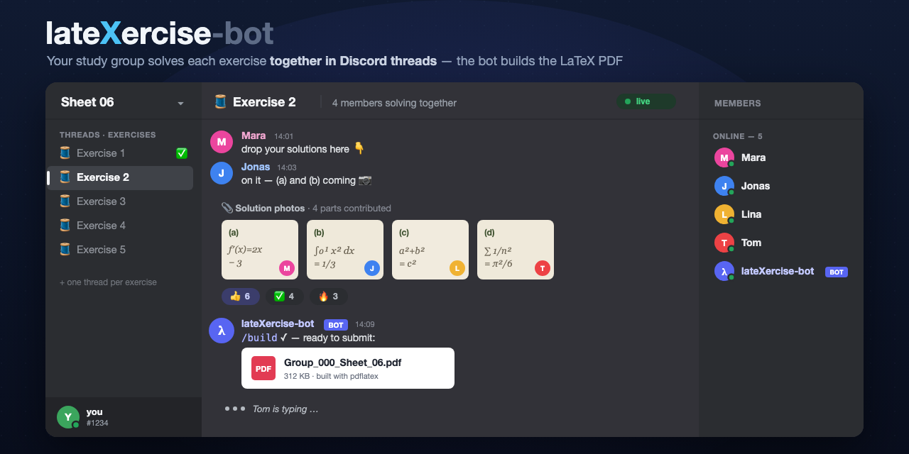

# lateXercise-bot



Automates the **collect → pick → build → submit** loop for a study group's
exercise sheets, inside Discord. Group members drop candidate
solution photos into per-exercise threads; the bot assembles the chosen images
into the existing LaTeX project and posts a ready-to-submit
`Group_000_Sheet_YY.pdf`.

You can run **several submission groups at once** — list one channel per group in
`ALLOWED_CHANNEL_IDS`. Each channel is fully independent: its own `/sheet` sheets,
`/pick` selections, and per-channel `/config` (group number, course, tutorial, authors),
so different channels can submit under different group numbers and names.

See [PLAN.md](PLAN.md) for the full design rationale. **Setting this up for your own study
group?** Follow [SETUP.md](SETUP.md) — you can reuse the LaTeX style and just change the group
number, course, tutorial, and names with no code edits.

## Commands

| Command | Where | What it does |
|---|---|---|
| `/help` | anywhere | Shows the workflow and every command in Discord. |
| `/sheet <sheet> <num_exercises>` | an allowed channel | Creates `num_exercises` public threads (`Sheet 06 · Exercise 1 … N`) and posts a hub message linking them. Sheets are scoped to the channel they're created in. |
| `/pick` | inside an exercise thread | Lists the thread's uploaded images as a numbered gallery; you map sub-parts to image numbers (e.g. `a: 2`, `b: 5, 6`, `a b: 3`, or `: 2` for a whole-exercise photo). Re-running replaces that exercise's selection. The same image number on **consecutive** parts (`a: 2`, `b: 2`) is auto-combined into one `(a) (b)` figure instead of repeating the image; if the run is interrupted (`a: 2`, `b: 2`, `c: 7`, `d: 2`) the image is repeated for the later part. |
| `/build <sheet> [skip_missing]` | an allowed channel | Re-fetches each picked image, generates `ex<NN>/ex<NN>.tex`, compiles from the project root, and posts `Group_<group>_Sheet_<NN>.pdf` into the channel. |
| `/config [group] [course] [tutorial] [authors] [reset]` | an allowed channel | View or set the **per-channel** header values (group number, course, tutorial, authors) used in the PDF header and filename. Each channel keeps its own values, so different groups can differ. No code/`exercise.sty` edits needed. |

## Customization (header & filename)

The group number, course, tutorial label, and author list can be set **per channel** without
editing `exercise.sty` — either live via `/config` (run it in a channel to view/set that
channel's values) or as global defaults in `.env` (`GROUP_NUMBER`, `COURSE`, `TUTORIUM`,
`AUTHORS`). Precedence: `/config` (per channel) > `.env` (global) > `exercise.sty`. The bot
injects the chosen values into the *generated* `.tex` via `\renewcommand`, so the shared style
file is never touched. See [SETUP.md](SETUP.md#6-customize-it-for-your-group).

## How it fits the existing LaTeX project

The LaTeX project lives in [`latex-project/`](latex-project/) (with `exercise.sty`
and the hand-made `ex1/`…`ex5/`). The bot **never edits `exercise.sty`**. It only writes
its own zero-padded `ex06/`, `ex07/`, … folders and a generated `.tex`, then compiles with
`-jobname=Group_<group>_Sheet_<NN>` so the output filename is correct (the group number comes
from `/config`/`.env` if set, otherwise `\ExerciseGroup` in `exercise.sty`). Any per-channel
header overrides are injected into the generated `.tex` via `\renewcommand`. Generated `ex<NN>/`
folders are gitignored; the legacy single-digit `ex1`…`ex5` are not touched.

Because each group's PDF is named per group (`Group_<group>_Sheet_NN.pdf`), the outputs of two
channels building the same sheet number never collide, and the bot serializes the compile step
so concurrent builds can't corrupt each other's output.

## Setup

### 1. Discord Developer Portal

1. Create an application → add a **Bot** → copy the **token**.
2. **Privileged Gateway Intents:** turn **Message Content** **ON**. Leave **Server Members**
   and **Presence** **OFF**.

   > ⚠️ **Why Message Content is required** (this corrects a note in the original plan):
   > `/pick` reads photos that *other* group members upload into a thread. Discord only
   > populates `attachments` on messages **not** authored by the bot when the **Message
   > Content** privileged intent is enabled. Without it, `/pick` sees zero candidates.
   > It is a free toggle (no bot verification needed under 100 servers).
3. OAuth2 → URL generator → scopes **`bot`** + **`applications.commands`**, with permissions:
   *View Channels, Send Messages, Create Public Threads, Send Messages in Threads,
   Read Message History, Attach Files, Embed Links* (optionally *Manage Threads*). Invite the
   bot to your server.
4. Enable Developer Mode in Discord and **Copy ID** for your guild and each operating
   channel (one per submission group). Restrict the bot to those channels with channel
   permission overwrites *and* the `ALLOWED_CHANNEL_IDS` guard below.

### 2. Configuration

Copy `.env.example` to `.env` and fill it in:

```
DISCORD_TOKEN=...            # bot token (secret)
GUILD_ID=...                 # your server ID
ALLOWED_CHANNEL_IDS=...      # comma-separated channel IDs, one per submission group (e.g. 111,222,333)
                            # the old singular ALLOWED_CHANNEL_ID still works as an alias
LATEX_PROJECT_DIR=./latex-project
DB_PATH=./data/latexercise.sqlite3
TEX_CMD=                     # optional: absolute path to latexmk/pdflatex (launchd/systemd)
DOWNSCALE_MAX_PX=2000        # optional: shrink long side before placing (needs Pillow)
ANNOUNCE_PICKS=true          # optional: post a public confirmation in-thread on /pick
```

`.env` is gitignored — never commit it.

### 3. Install & run

```bash
python3 -m venv .venv
.venv/bin/python -m pip install -r requirements.txt
.venv/bin/python bot.py
```

Requires **Python ≥ 3.10**. Commands are guild-scoped, so they appear within seconds.

### LaTeX toolchain (needed only for `/build`)

`/build` resolves a compiler from `PATH` (preferring `latexmk`, falling back to `pdflatex`),
or from `TEX_CMD` if set. It preflights and aborts with install hints if none is found.

- **macOS:** install [MacTeX](https://www.tug.org/mactex/) (adds `/Library/TeX/texbin`).
  Under launchd's minimal `PATH`, set `TEX_CMD=/Library/TeX/texbin/latexmk`.
- **Linux:** `apt install texlive-latex-recommended texlive-latex-extra texlive-lang-german latexmk`
  (or `texlive-full`). Run under a `systemd` unit with `EnvironmentFile=.env`, `Restart=on-failure`.

Supported image formats are **PNG, JPEG, PDF** (what `pdflatex` can embed). HEIC/WEBP/GIF are
detected by magic bytes and rejected with a clear per-image message — re-upload as PNG/JPEG.

## Architecture

```
bot.py              entrypoint: intents, cog load, guild-scoped sync, run
bot/
  config.py         .env loading + validation (Settings dataclass)
  store.py          SQLite (aiosqlite, WAL): per-channel sheets, thread mapping, selections, config
  latex.py          framework-free .tex generation + compile + log parsing
  images.py         attachment download, magic-byte format check, naming, downscale
  ui.py             discord.ui pick widgets + the pure pick-spec parser
  cogs/exercises.py /help, /config, /sheet, /pick, /build app commands
tests/              pytest: latex, store (+migration), config, pick-spec parser, image helpers
```

All persistence is keyed by channel id so multiple channels run as independent submission
groups; an older single-channel database is auto-migrated to the new schema on first startup.

## Tests

```bash
.venv/bin/python -m pytest tests/ -q
```

The suite is dependency-light (stdlib + pytest) and needs **no** Discord connection and **no**
LaTeX install — it covers `.tex` generation, the SQLite store, the pick-spec parser, and the
image helpers.
